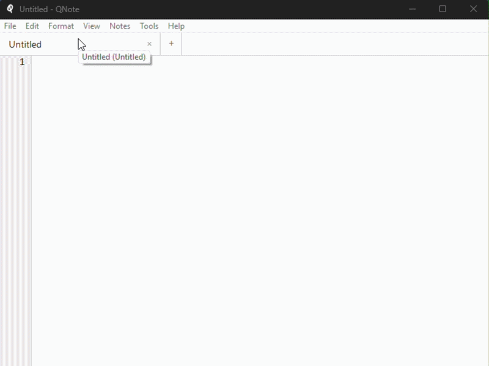

# QNote — A Better Notepad for Windows

<p align="center">
  
</p>

<p align="center">
  <a href="https://qnote.ar0.eu">Website</a> · <a href="https://qnote.ar0.eu/download">Download</a> · <a href="LICENSE">MIT License</a>
</p>

QNote is a free, open-source notepad replacement for Windows. Small footprint, native UI, zero telemetry — with the editing features you actually want.

## Features

- Tabbed editing with multi-level undo/redo
- VS Code-style line editing — cut/copy line, move/duplicate lines, smart home, block indent
- Find & replace with regex support
- Built-in notes system with quick capture, pinning, and full-text search
- Bookmarks, line numbers, show whitespace, zoom
- Text tools — sort, trim, join, split, case conversion, URL/Base64 encode, JSON format
- UTF-8, UTF-16, ANSI encodings · CRLF/LF/CR line endings
- Auto-save, drag-and-drop, print, dark title bar, customisable shortcuts

---

## Keyboard Shortcuts

| Shortcut | Action | Shortcut | Action |
|---|---|---|---|
| Ctrl+N | New file | Ctrl+T | New tab |
| Ctrl+O | Open | Ctrl+W | Close tab |
| Ctrl+S | Save | Ctrl+Tab | Next tab |
| Ctrl+Shift+S | Save as | Ctrl+P | Print |
| Ctrl+Z | Undo | Ctrl+Y | Redo |
| Ctrl+X | Cut *(line if no sel)* | Ctrl+C | Copy *(line if no sel)* |
| Ctrl+V | Paste | Ctrl+A | Select all |
| Ctrl+D | Duplicate line | Ctrl+L | Select line |
| Ctrl+Shift+K | Delete line | Home | Smart Home |
| Alt+Up/Down | Move line up/down | Alt+Shift+Up/Down | Copy line up/down |
| Ctrl+Enter | Insert line below | Ctrl+Shift+Enter | Insert line above |
| Tab *(selection)* | Indent | Shift+Tab | Unindent |
| Ctrl+F | Find | Ctrl+H | Replace |
| F3 | Find next | Ctrl+G | Go to line |
| F2 | Toggle bookmark | Ctrl+F2 | Next bookmark |
| Ctrl++/- | Zoom in/out | Ctrl+0 | Reset zoom |
| Ctrl+Shift+U | Uppercase | Ctrl+U | Lowercase |
| Ctrl+Shift+Q | Quick capture | Ctrl+Shift+F | Search notes |
| F5 | Insert date/time | Ctrl+Shift+A | All notes |

---

## Building

### Prerequisites

- **Visual Studio 2019+** with C++ Desktop Development workload
- **CMake 3.16+**
- **Inno Setup 6** *(optional — for creating the installer)*

### Quick Build

```batch
cd scripts
build.bat release
```

The executable is placed in the project root and `build/` folder.

### Manual Build

```batch
mkdir build && cd build
cmake -G "NMake Makefiles" -DCMAKE_BUILD_TYPE=Release ..
cmake --build .
```

### Creating a Release

```batch
cd scripts
release.bat 1.0.0
```

Produces `QNote-1.0.0-Portable.zip` and `QNote-1.0.0-Setup.exe` (if Inno Setup is installed).

## License

[MIT](LICENSE)
